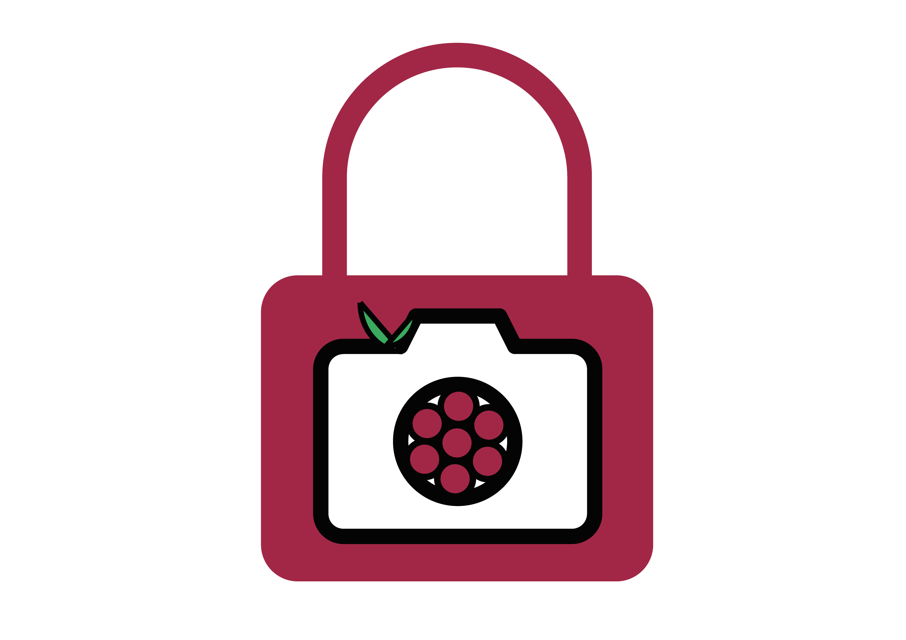

# GuardMyPi
The ultimate security tool to protect your berries from unauthorised tampering. 

https://www.guardmypi.com/

<!--
*** Thanks for checking out the Best-README-Template. If you have a suggestion
*** that would make this better, please fork the repo and create a pull request
*** or simply open an issue with the tag "enhancement".
*** Thanks again! Now go create something AMAZING! :D
-->


<!-- PROJECT SHIELDS -->
<!--
*** I'm using markdown "reference style" links for readability.
*** Reference links are enclosed in brackets [ ] instead of parentheses ( ).
*** See the bottom of this document for the declaration of the reference variables
*** for contributors-url, forks-url, etc. This is an optional, concise syntax you may use.
*** https://www.markdownguide.org/basic-syntax/#reference-style-links
-->
[![Contributors][contributors-shield]][contributors-url]
[![Forks][forks-shield]][forks-url]
[![Stargazers][stars-shield]][stars-url]
[![Issues][issues-shield]][issues-url]
[![MIT License][license-shield]][license-url]
[![LinkedIn][linkedin-shield]][linkedin-url]


<!-- PROJECT LOGO -->
<br />
<p align="center">
  <a href="https://github.com/phgelado/guardmypi/">
    
  </a>

  <h3 align="center">Best-README-Template</h3>

  <p align="center">
    An awesome README template to jumpstart your projects!
    <br />
    <a href="https://github.com/othneildrew/Best-README-Template"><strong>Explore the docs »</strong></a>
    <br />
    <br />
    <a href="https://github.com/othneildrew/Best-README-Template">View Demo</a>
    ·
    <a href="https://github.com/othneildrew/Best-README-Template/issues">Report Bug</a>
    ·
    <a href="https://github.com/othneildrew/Best-README-Template/issues">Request Feature</a>
  </p>
</p>


<!-- TABLE OF CONTENTS -->
<details open="open">
  <summary>Table of Contents</summary>
  <ol>
    <li>
      <a href="#about-the-project">About The Project</a>
      <ul>
        <li><a href="#built-with">Built With</a></li>
      </ul>
    </li>
    <li>
      <a href="#getting-started">Getting Started</a>
      <ul>
        <li><a href="#prerequisites">Prerequisites</a></li>
        <li><a href="#installation">Installation</a></li>
      </ul>
    </li>
    <li><a href="#usage">Usage</a></li>
    <li><a href="#roadmap">Roadmap</a></li>
    <li><a href="#contributing">Contributing</a></li>
    <li><a href="#license">License</a></li>
    <li><a href="#contact">Contact</a></li>
    <li><a href="#acknowledgements">Acknowledgements</a></li>
  </ol>
</details>


<!-- ABOUT THE PROJECT -->
## About The Project

[![Product Name Screen Shot][product-screenshot]](https://example.com)

GuardMyPi is a home security system centred around the Raspberry Pi 3. It utilises the Pi NoIR Camera to monitor a room or entrance point in a house. Facial recognition software is used to distinguish between house members (including pets) and intruders. If an intruder is detected, a notification is sent to the user via a web application. 

### Built With

* [OpenCV](https://sourceforge.net/projects/opencvlibrary/)

### Hardware used

* Raspberry Pi 3
* Pi NoIR Camera V2

<!-- GETTING STARTED -->
## Getting Started

This is an example of how you may give instructions on setting up your project locally.
To get a local copy up and running follow these simple example steps.

### Prerequisites

This is an example of how to list things you need to use the software and how to install them.
* npm
  ```sh
  npm install npm@latest -g
  ```

### Installation of OpenCV4 on Raspberry Pi 

1. Downloading pre-built OpenCV4
```sh
wget https://github.com/sol-prog/raspberry-pi-opencv/releases/download/opencv4rpi2.1/opencv-4.1.0-armhf.tar.bz2
```
2. Extract the archive
   ```sh
   tar xvf opencv-4.1.0-armhf.tar.bz2
   ```
3. Move the extracted archive to the /opt folder 
   ```sh
   sudo mv opencv-4.1.0 /opt
   ```
4. Remove the archive (optional) 
   ```sh
   rm opencv-4.1.0-armhf.tar.bz2
   ```
5. Install video and image support packages
 ```sh 
sudo apt install libjpeg-dev libtiff-dev libjasper-dev libpng-dev libwebp-dev libopenexr-dev
sudo apt install libavcodec-dev libavformat-dev libswscale-dev libv4l-dev libxvidcore-dev libx264-dev libdc1394-22-dev libgstreamer-plugins-base1.0-dev libgstreamer1.0-dev
```
6. Install packages needed for OpenCV's interface
```sh
sudo apt install libgtk-3-dev libqtgui4 libqtwebkit4 libqt4-test python3-pyqt5
```
7. Install packages for OpenCV to run at a good speed
```sh
sudo apt install libatlas-base-dev liblapacke-dev gfortran
```
8. Add OpenCV to the system path 
```sh
cd ~
echo 'export LD_LIBRARY_PATH=/opt/opencv-4.1.0/lib:$LD_LIBRARY_PATH' >> .bashrc
. .bashrc
```
9. Restart the terminal or log back in to the RPi if connected via SSH

10. Install git if necessary
```sh
sudo apt-get install git
```
11. Clone a config file to use OpenCV for C++
```sh 
git clone https://gist.github.com/sol-prog/ed383474872958081985de733eaf352d opencv_cpp_compile_settings
 cd opencv_cpp_compile_settings/
 sudo cp opencv.pc /usr/lib/arm-linux-gnueabihf/pkgconfig
 cd ~
 rm -rf opencv_cpp_compile_settings/
```
12. Check OpenCV has installed correctly on the RPi 
```sh
pkg-config --modversion opencv
```


<!-- USAGE EXAMPLES -->
## Usage

Use this space to show useful examples of how a project can be used. Additional screenshots, code examples and demos work well in this space. You may also link to more resources.

_For more examples, please refer to the [Documentation](https://example.com)_


<!-- ROADMAP -->
## Roadmap

See the [open issues](https://github.com/othneildrew/Best-README-Template/issues) for a list of proposed features (and known issues).


<!-- CONTRIBUTING -->
## Contributing

Contributions are what make the open source community such an amazing place to be learn, inspire, and create. Any contributions you make are **greatly appreciated**.

1. Fork the Project
2. Create your Feature Branch (`git checkout -b feature/AmazingFeature`)
3. Commit your Changes (`git commit -m 'Add some AmazingFeature'`)
4. Push to the Branch (`git push origin feature/AmazingFeature`)
5. Open a Pull Request


<!-- LICENSE -->
## License

Distributed under the MIT License. See `LICENSE` for more information.


<!-- CONTACT -->
## Contact

Magnus Bell Cochran - 2258776B@student.gla.ac.uk

Pedro Hernandez Gelado - 2262004h@student.gla.ac.uk

Aidan Porteous - 2262004h@student.gla.ac.uk

Project Link: [https://github.com/phgelado/guardmypi](https://github.com/phgelado/guardmypi)


<!-- ACKNOWLEDGEMENTS -->
## Acknowledgements
* [GitHub Emoji Cheat Sheet](https://www.webpagefx.com/tools/emoji-cheat-sheet)
* [Img Shields](https://shields.io)
* [Choose an Open Source License](https://choosealicense.com)
* [GitHub Pages](https://pages.github.com)
* [Animate.css](https://daneden.github.io/animate.css)
* [Loaders.css](https://connoratherton.com/loaders)
* [Slick Carousel](https://kenwheeler.github.io/slick)
* [Smooth Scroll](https://github.com/cferdinandi/smooth-scroll)
* [Sticky Kit](http://leafo.net/sticky-kit)
* [JVectorMap](http://jvectormap.com)
* [Font Awesome](https://fontawesome.com)


<!-- MARKDOWN LINKS & IMAGES -->
<!-- https://www.markdownguide.org/basic-syntax/#reference-style-links -->
[contributors-shield]: https://img.shields.io/github/contributors/phgelado/guardmypi.svg?style=for-the-badge
[contributors-url]: https://github.com/phgelado/guardmypi/contributors
[forks-shield]: https://img.shields.io/github/forks/othneildrew/Best-README-Template.svg?style=for-the-badge
[forks-url]: https://github.com/othneildrew/Best-README-Template/network/members
[stars-shield]: https://img.shields.io/github/stars/othneildrew/Best-README-Template.svg?style=for-the-badge
[stars-url]: https://github.com/othneildrew/Best-README-Template/stargazers
[issues-shield]: https://img.shields.io/github/issues/othneildrew/Best-README-Template.svg?style=for-the-badge
[issues-url]: https://github.com/othneildrew/Best-README-Template/issues
[license-shield]: https://img.shields.io/github/license/othneildrew/Best-README-Template.svg?style=for-the-badge
[license-url]: https://github.com/othneildrew/Best-README-Template/blob/master/LICENSE.txt
[linkedin-shield]: https://img.shields.io/badge/-LinkedIn-black.svg?style=for-the-badge&logo=linkedin&colorB=555
[linkedin-url]: https://linkedin.com/in/othneildrew
[product-screenshot]: images/screenshot.png
