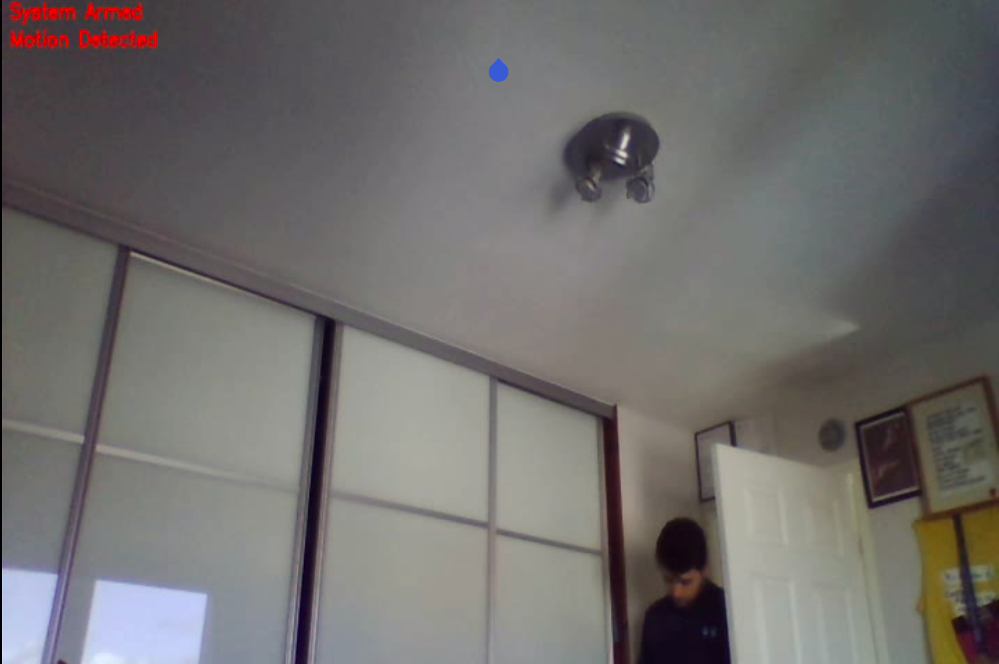
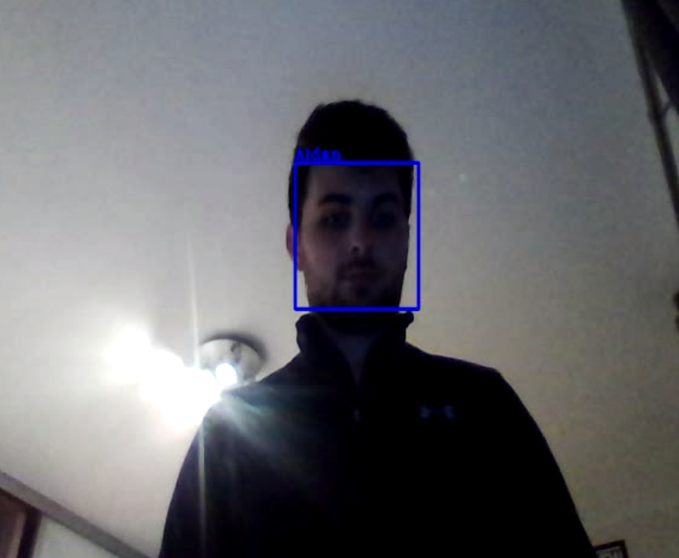

# GuardMyPi


<!-- PROJECT SHIELDS -->
<!--
*** I'm using markdown "reference style" links for readability.
*** Reference links are enclosed in brackets [ ] instead of parentheses ( ).
*** See the bottom of this document for the declaration of the reference variables
*** for contributors-url, forks-url, etc. This is an optional, concise syntax you may use.
*** https://www.markdownguide.org/basic-syntax/#reference-style-links
-->
[![Contributors][contributors-shield]][contributors-url]
[![Forks][forks-shield]][forks-url]
[![Stargazers][stars-shield]][stars-url]
[![Issues][issues-shield]][issues-url]
[![MIT License][license-shield]][license-url]
[![LinkedIn][linkedin-shield]][linkedin-url]


<!-- PROJECT LOGO -->
<br />
<p align="center">
  <a href="https://github.com/phgelado/guardmypi/">
    
  </a>

  <h3 align="center">GuardMyPi</h3>

  <p align="center">
    The ultimate security tool to protect your berries from unauthorised tampering. 
    <br />
    <a href="https://www.guardmypi.com/"><strong>guardmypi.com »</strong></a>
    <br />
  </p>
</p>


<!-- TABLE OF CONTENTS -->
<details open="open">
  <summary>Table of Contents</summary>
  <ol>
    <li>
      <a href="#about-the-project">About The Project</a>
      <ul>
        <li><a href="#built-with">Built With</a></li>
        <li><a href="#hardware-used">Hardware Used</a></li>
      </ul>
    </li>
    <li>
      <a href="#getting-started">Getting Started</a>
      <ul>
        <li><a href="#prerequisites">Prerequisites</a></li>
        <li><a href="#installation-of-cmake">Installation of CMake</a></li>
        <li><a href="#installation-of-opencv4-on-raspberry-pi">Installation of OpenCV4 on Raspberry Pi</a></li>
        <li><a href="#installation-of-mjpg-streamer-on-raspberry-pi">Installation of mjpg-streamer on Raspberry Pi</a></li>
        <li><a href="#installation-of-dataplicity">Installation of Dataplicity</a></li>
        <li><a href="#installation-of-mailutils">Installation of mailutils</a></li> 
      </ul>
    <li>
      <a href="#how-to-use">How to use</a>
      <ul>
        <li><a href="#building-the-program">Building the Program</a></li>
        <li><a href="#customisation">Customisation</a></li>
      </ul>
    </li>
    <li><a href="#usage">Usage Examples</a></li>
    <li><a href="#contributing">Contributing</a></li>
    <li><a href="#license">License</a></li>
    <li><a href="#contact">Contact</a></li>
    <li><a href="#acknowledgements">Acknowledgements</a></li>
  </ol>
</details>


<!-- ABOUT THE PROJECT -->
## About The Project

<!-- [![Product Name Screen Shot][product-screenshot]](https://example.com) -->

GuardMyPi is a home security system centred around the Raspberry Pi 3. It utilises the Pi NoIR Camera to monitor a room or entrance point in a house. If the camera detects motion, object detection methods are used to check whether the source of motion is a human or a pet. If a human, facial recognition software is used to determine if it is a household member, or if not recognised, an intruder. If an intruder is detected, the user will receive an email notifying them, and will be able to access the camera via remote streaming from our website. Additionally, the Pi will save video evidence of the intruder which can be accessed later.

You can find our doxygen documentation [here](https://phgelado.com/guardmypi/).

### Built With

* C++
* [OpenCV](https://opencv.org/)
* [mjpg-streamer](https://github.com/jacksonliam/mjpg-streamer)
* [Dataplicity](https://www.dataplicity.com/)


### Hardware used

* [Raspberry Pi 3B](https://www.raspberrypi.org/products/raspberry-pi-3-model-b/)
* [Pi NoIr Camera V2](https://www.raspberrypi.org/products/pi-noir-camera-v2/)
* [Infrared LED Ring](https://www.amazon.co.uk/Infrared-Illuminator-Board-Security-Camera/dp/B0057DPXI4/ref=sr_1_3?dchild=1&keywords=Infrared+IR+board&qid=1614706403&sr=8-3)
* [Step Up DC-DC converter](https://www.ebay.co.uk/itm/MT3608-DC-DC-Voltage-Step-Up-Adjustable-Boost-Converter-Module-2A-UK/193424475011)
* [Camera Enclosure](https://thepihut.com/products/raspberry-pi-4-3-camera-case)

<!-- GETTING STARTED -->
## Getting Started

### Prerequisites

To be able to run this project locally you will need to install the following dependencies: 

* [CMake](https://cmake.org/)
* [OpenCV](https://sourceforge.net/projects/opencvlibrary/)
* [mjpg-streamer](https://github.com/jacksonliam/mjpg-streamer)
* [Dataplicity](https://www.dataplicity.com/)
* mailutils

### Installation of CMake

 ```
sudo apt-get install cmake
```

### Installation of OpenCV4 on Raspberry Pi

1. Downloading pre-built OpenCV4
```sh
wget https://github.com/sol-prog/raspberry-pi-opencv/releases/download/opencv4rpi2.1/opencv-4.1.0-armhf.tar.bz2
```
2. Extract the archive
   ```sh
   tar xvf opencv-4.1.0-armhf.tar.bz2
   ```
3. Move the extracted archive to the /opt folder 
   ```sh
   sudo mv opencv-4.1.0 /opt
   ```
4. Remove the archive (optional) 
   ```sh
   rm opencv-4.1.0-armhf.tar.bz2
   ```
5. Install video and image support packages
 ```sh 
sudo apt install libjpeg-dev libtiff-dev libjasper-dev libpng-dev libwebp-dev libopenexr-dev
sudo apt install libavcodec-dev libavformat-dev libswscale-dev libv4l-dev libxvidcore-dev libx264-dev libdc1394-22-dev libgstreamer-plugins-base1.0-dev libgstreamer1.0-dev
```
6. Install packages needed for OpenCV's interface
```sh
sudo apt install libgtk-3-dev libqtgui4 libqtwebkit4 libqt4-test python3-pyqt5
```
7. Install packages for OpenCV to run at a good speed
```sh
sudo apt install libatlas-base-dev liblapacke-dev gfortran
```
8. Add OpenCV to the system path 
```sh
cd ~
echo 'export LD_LIBRARY_PATH=/opt/opencv-4.1.0/lib:$LD_LIBRARY_PATH' >> .bashrc
. .bashrc
```
9. Restart the terminal or log back in to the RPi if connected via SSH

10. Install git if necessary
```sh
sudo apt-get install git
```
11. Clone a config file to use OpenCV for C++
```sh 
git clone https://gist.github.com/sol-prog/ed383474872958081985de733eaf352d opencv_cpp_compile_settings
 cd opencv_cpp_compile_settings/
 sudo cp opencv.pc /usr/lib/arm-linux-gnueabihf/pkgconfig
 cd ~
 rm -rf opencv_cpp_compile_settings/
```
12. Check OpenCV has installed correctly on the RPi 
```sh
pkg-config --modversion opencv
```

### Installation of mjpg-streamer on Raspberry Pi

1. Ensure you have CMake installed, as well as the dependencies mjpg-streamer uses: 
```
sudo apt-get install libjpeg8-dev imagemagick libv4l-dev
```

2. Clone the mjpg-streamer repository you can find [here](https://github.com/jacksonliam/mjpg-streamer).
```
git clone https://github.com/jacksonliam/mjpg-streamer
```
4. Access the mjpg-streamer directory. 
```
cd mjpg-streamer
cd mjpg-streamer-experimental
```
4. Build and install mjpg-streamer using CMake.
```
make
sudo make install
```

### Installation of Dataplicity

Dataplicity is a simple to use, safe and free tool for you to access and control your RaspberryPi remotely, allowing you to setup and start your alarm from anywhere, as well as accessing the camera's live video feed. 

Similar to a VPN, but easier to install, it also allows you to access your Pi's local port 80 (http://localhost:80) through a domain, which is where the Pi's live camera feed is streamed to. Installing Dataplicity is very simple! Follow the instructions [here](https://www.dataplicity.com/).

### Installation of mailutils
```
sudo apt install mailutils
```
<!-- HOW TO USE -->
## How to use

### Building the Program

```
git clone https://github.com/phgelado/guardmypi
cd guardmypi
cmake .
make
./newmain
```

To set up the streaming, in a separate terminal run the following command from your root, i.e. pi@raspberrypi:

```
sudo LD_LIBRARY_PATH=/usr/local/lib mjpg_streamer -i "input_file.so -f ./guardmypi/ -n test.jpg" - o "output_http.so -w /home/pi/mjpg-streamer/mjpg-streamer-experimental/www -p 80"
```
Dataplicity should already be up and running from installation, double check you can see and access your device [here](https://www.dataplicity.com/devices). 

### Customisation

Note that the program is currently set up to run for a specific user. If you wish to customise the program for your own needs, here are some useful links:
* [Facial recognition using OpenCV](https://docs.opencv.org/3.4/da/d60/tutorial_face_main.html). A user can use pictures of their own face to train a facial recognition model. This can then be saved in a yml file and replace the 'guardingthepi.yml' file.
* [Training an object detection model using OpenCV](https://memememememememe.me/post/training-haar-cascades/#:~:text=It's%20basically%20a%20machine%20learning,you%20have%20the%20right%20classifiers.) OpenCV can also be trained to detect objects using Haar Cascades. This has been applied to the pet detection in our case, and a user could train a cascade to recognise their own pet's face. Please note that both the training for this and facial recognition should be carried out on a more powerful device than a Pi, for example a laptop or PC. This requires installation of OpenCV3 rather than 4 on the device - just follow this [link](https://linuxize.com/post/how-to-install-opencv-on-ubuntu-20-04/) and make sure to use the 3.4 branch when building.
* You can create your own unlock and lock keys, that you will be able to convert into a QR Code readable by GuardMyPi. We encourage you to regularly change your unlock key if possible, and to use high encryption (256+ bit) keys. You can create encryption keys at this [link](https://www.allkeysgenerator.com/Random/Security-Encryption-Key-Generator.aspx) and then copy and paste your key into a [QR Code Generator](https://www.qr-code-generator.com/), ensuring you click on "text". You can then download or take a screenshot of this QR Code, maybe print it out if you're old school! Keep it in a safe place, it will allow you to unlock and lock GuardMyPi. Note: from installation the QR code keys are "unlock" and "lock".
* Make sure to change the email address given in the "guardmypi.cpp" file to your own.


<!-- USAGE EXAMPLES -->
## Usage Examples





<!-- CONTRIBUTING -->
## Contributing

Contributions are what make the open source community such an amazing place to be learn, inspire, and create. Any contributions you make are **greatly appreciated**.

1. Fork the Project
2. Create your Feature Branch (`git checkout -b feature/AmazingFeature`)
3. Commit your Changes (`git commit -m 'Add some AmazingFeature'`)
4. Push to the Branch (`git push origin feature/AmazingFeature`)
5. Open a Pull Request


<!-- LICENSE -->
## License

Distributed under the MIT License. See `LICENSE` for more information.


<!-- CONTACT -->
## Contact

Magnus Bell Cochran - 2258776B@student.gla.ac.uk

Pedro Hernandez Gelado - 2262004h@student.gla.ac.uk

Aidan Porteous - 2245628p@student.gla.ac.uk

Project Link: [https://github.com/phgelado/guardmypi](https://github.com/phgelado/guardmypi)


<!-- ACKNOWLEDGEMENTS -->
## Acknowledgements
* [README Template](https://github.com/othneildrew/Best-README-Template)


<!-- MARKDOWN LINKS & IMAGES -->
<!-- https://www.markdownguide.org/basic-syntax/#reference-style-links -->
[contributors-shield]: https://img.shields.io/github/contributors/phgelado/guardmypi.svg?style=for-the-badge
[contributors-url]: https://github.com/phgelado/guardmypi/contributors
[forks-shield]: https://img.shields.io/github/forks/phgelado/guardmypi.svg?style=for-the-badge
[forks-url]: https://github.com/phgelado/guardmypi/network/members
[stars-shield]: https://img.shields.io/github/stars/phgelado/guardmypi.svg?style=for-the-badge
[stars-url]: https://github.com/phgelado/guardmypi/stargazers
[issues-shield]: https://img.shields.io/github/issues/phgelado/guardmypi.svg?style=for-the-badge
[issues-url]: https://github.com/phgelado/guardmypi/issues
[license-shield]: https://img.shields.io/github/license/phgelado/guardmypi.svg?style=for-the-badge
[license-url]: https://github.com/phgelado/guardmypi/blob/master/LICENSE.txt
[linkedin-shield]: https://img.shields.io/badge/-LinkedIn-black.svg?style=for-the-badge&logo=linkedin&colorB=555
[linkedin-url]: https://www.linkedin.com/company/guardmypi/
[product-screenshot]: images/screenshot.png
